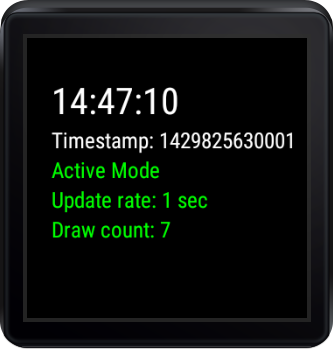
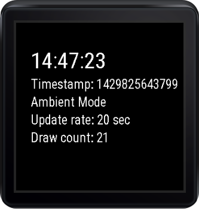
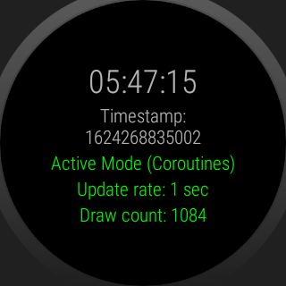
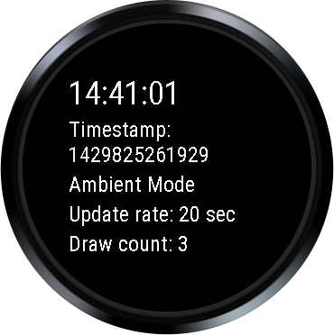

Android AlwaysOn Sample
=======================

A basic sample showing how to support ambient mode for native Wear apps.

Introduction
------------

[WearableActivity][1] offers methods for supporting your native app staying on the screen when the Wear device enters ambient mode.

This example extends [WearableActivity][1] and overrides onEnterAmbient, onUpdateAmbient, and onExitAmbient to allow the simple native Wear app to support ambient mode.

In ambient mode, this app follows best practices by keeping most pixels black, avoiding large blocks of white pixels, using only black and white, and disabling anti-aliasing (following the [design guidelines for Watch Faces][2]).

In addition and most importantly, the app sleeps while in ambient mode for 20 seconds between any updates to conserving battery life (processor allowed to sleep). If you can hold off on updates for a full minute, you can throw away the Handler and just use onUpdateAmbient to save even more battery life.

As always, you will still want to apply the [performance guidelines][3] outlined in the Watch Face documentation to your app.

[1]: http://developer.android.com/reference/android/support/wearable/activity/WearableActivity.html
[2]: https://developer.android.com/training/wearables/watch-faces/designing.html#DesignGuidelines
[3]: https://developer.android.com/training/wearables/watch-faces/performance.html

Pre-requisites
--------------

- Android SDK 28
- Android Build Tools v28.0.3
- Android Support Repository

Screenshots
-------------

    

Getting Started
---------------

This sample uses the Gradle build system. To build this project, use the
"gradlew build" command or use "Import Project" in Android Studio.

Support
-------

- Google+ Community: https://plus.google.com/communities/105153134372062985968
- Stack Overflow: http://stackoverflow.com/questions/tagged/android

If you've found an error in this sample, please file an issue:
https://github.com/googlesamples/android-AlwaysOn

Patches are encouraged, and may be submitted by forking this project and
submitting a pull request through GitHub. Please see CONTRIBUTING.md for more details.
