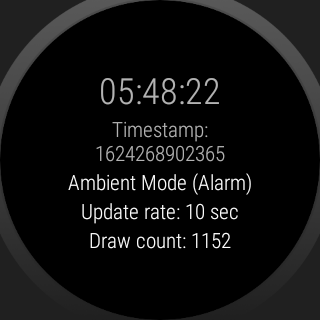

Android AlwaysOn Kotlin Sample
=======================

A basic sample showing how to support [Ambient Mode][5] for native Wear apps.

Introduction
------------

The [AmbientModeSupport][1] class offers a set of methods which allow your native app to stay on the screen when the Wear device enters ambient mode.

This example implements the [AmbientCallbackProvider][2] interface and provides behavior for `onEnterAmbient`, `onUpdateAmbient`, and `onExitAmbient` to allow the native Wear app to support ambient mode.

All [Ambient Mode Principles and Best Practices](#ambient-mode-best-practices) are adhered to. Crucially, the conservation of battery life is prioritized, as the app will sleep while in ambient mode for 10 seconds between any updates, allowing the processor to sleep.

This implementation leverages an `AlarmManger` instance to manually invoke `onUpdateAmbient` every 10 seconds instead of the 60 second default invocation interval.  Implementations should strive to avoid this behavior and rely on the default interval to save as much battery life as possible.

As always, your app should adhere to the [performance guidelines][4] outlined in the Watch Face documentation, and follow the [design guidelines for Watch Faces][3].

[1]: https://developer.android.com/reference/androidx/wear/ambient/AmbientModeSupport
[2]: https://developer.android.com/reference/androidx/wear/ambient/AmbientModeSupport.AmbientCallbackProvider
[3]: https://developer.android.com/training/wearables/watch-faces/designing.html#DesignGuidelines
[4]: https://developer.android.com/training/wearables/watch-faces/performance.html
[5]: https://developer.android.com/training/wearables/views/always-on

> ### **Warning!**
>
> **Most apps should not use the always on/ambient mode APIs**, as they drain battery life and are redundant with the OS's always on behavior.
>
> By default, Wear OS will go into *system ambient mode* if the user hasn't interacted with the watch after the user-defined screen timeout duration (15 seconds by default). When the user interacts with the watch in ambient mode, the system will awaken in the same state it in was before ambient mode.

Ambient Mode Principles & Best Practices
-------------

#### Principles

* Prioritize the conservation of battery life
* Let the processor sleep as much as possible

#### Implementation Best Practices

* Keep most pixels black
* Avoid large blocks of white pixels
* Use only black and white color schemes
* Disabling anti-aliasing

Prerequisites
--------------

- Android SDK 30
- Requires AC to be configured off `adb emu power ac off`

Getting Started
---------------

This sample uses the Gradle build system. To build this project, use the
`gradlew build` command or use "Import Project" in Android Studio.

Screenshots
-------------

    

Support
-------

**Stack Overflow:** https://stackoverflow.com/questions/tagged/wear-os

**Error Reporting:** If you've found an error in this sample, please file an issue:
https://github.com/android/wear-os-samples

**Submitting Patches:** Patches are encouraged, and may be submitted by forking this project and
submitting a pull request through GitHub. Please see CONTRIBUTING.md for more details.
