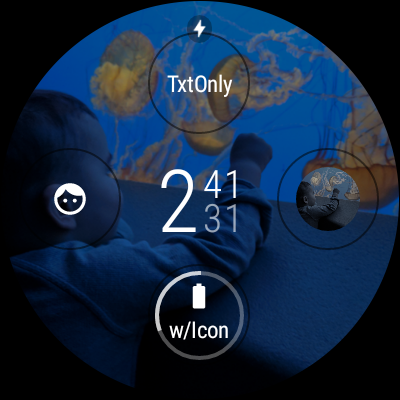

Android Complications Sample
============================

Complication Test Suite is a set of complication data sources that provide dummy data and it can be
used to test how different types of complications render on a watch face.

> [!IMPORTANT]  
> As of July 10, 2024, watch faces must use the [Watch Face Format][4] ([sample][6]) in order to be installed on new watches that launch with Wear OS 5 pre-installed. Learn more about the user-facing changes in this [Help Center][5] article.
>
> Additionally, starting in early 2025 (specific date to be announced during Q4 2024), all new watch faces published on Google Play must use the Watch Face Format.

Introduction
------------

Steps for trying out the sample:
* Compile and install the wearable app onto your Wear device or emulator (for Wear scenario).

* This sample does not have a main Activity (just Services that provide the complication data).
Therefore, you may see an error next to the 'Run' button. To fix, click on the
"Wearable" dropdown next to the 'Run' button and select 'Edit Configurations'. Under the
'Launch Options', change the 'Launch' field from 'Default APK' to 'Nothing' and save.

This sample provides dummy data for testing the complications UI in your watch face. After
selecting a type from your watch face configuration Activity, you can tap on the complications to
see more options.

The Wear app demonstrates the use of [ComplicationData][1], [ComplicationDataSourceService][2], and [ComplicationText][3].

Pre-requisites
--------------

- Android SDK 30

Screenshots
-------------

  

Getting Started
---------------

This sample uses the Gradle build system. To build this project, use the
"gradlew build" command or use "Import Project" in Android Studio.

Support
-------

- Stack Overflow: https://stackoverflow.com/questions/tagged/wear-os

If you've found an error in this sample, please file an issue:
https://github.com/android/wear-os-samples/issues

Patches are encouraged, and may be submitted by forking this project and
submitting a pull request through GitHub. Please see CONTRIBUTING.md for more details.

[1]: https://developer.android.com/reference/kotlin/androidx/wear/complications/data/ComplicationData
[2]: https://developer.android.com/reference/kotlin/androidx/wear/complications/datasource/ComplicationDataSourceService
[3]: https://developer.android.com/reference/kotlin/androidx/wear/complications/data/ComplicationText
[4]: https://developer.android.com/training/wearables/wff
[5]: https://support.google.com/wearos/thread/284572445
[6]: https://github.com/android/wear-os-samples/tree/main/WatchFaceFormat
