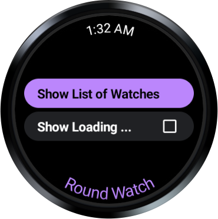
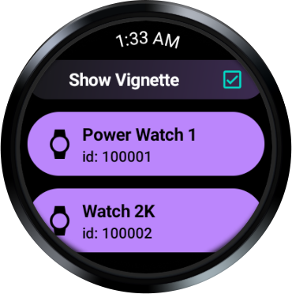
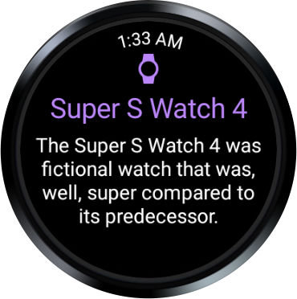
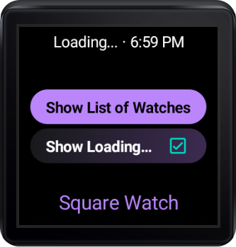
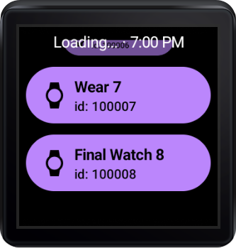
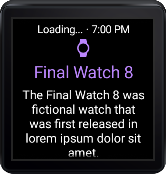

Compose for Wear OS Advanced Sample
===================================
Demonstrates Compose with the Wear optimized Scaffold, Navigation, curved text, and more!

Introduction
------------

Compose for Wear OS app that demonstrates how to use Wear specific Scaffold, Navigation,
curved text, Chips, and many other composables.

Displays different text at the bottom of the landing screen depending on shape of the device
(round vs. square/rectangular).

Screenshots
-----------

 
 
 

Getting Started
---------------

This sample uses the Gradle build system. To build this project,
use the "gradlew build" command or use "Import Project" in Android Studio.

Support
-------

**Have a feature request for Compose for Wear OS?**
  - [Submit](https://issuetracker.google.com/issues/new?component=1077552&template=1598429&pli=1)
    it to our team.

**Want to discuss Compose for Wear OS with us?**
  - [Join the Slack](https://surveys.jetbrains.com/s3/kotlin-slack-sign-up) #compose-wear channel
    and let us know what you think of Compose for Wear OS.

**General questions**
  - https://stackoverflow.com/questions/tagged/wear-os
  - http://stackoverflow.com/questions/tagged/android

If you've found an error in this sample, please file an issue:
https://github.com/android/wear-os-samples/issues/new

Patches are encouraged, and may be submitted by forking this project and
submitting a pull request through GitHub. Please see CONTRIBUTING.md for more details.
