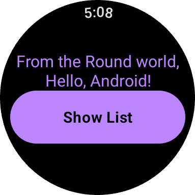
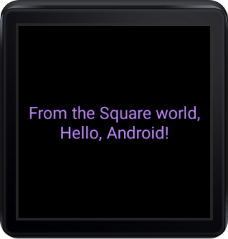

Compose for Wear OS Starter Sample
==================================
Demonstrates a simple "Hello, World" starter project for using Compose with Wear OS.

Introduction
------------

Simple "Hello, World" app meant as a starting point for a new project using
Compose for Wear OS.

Displays only a centered [Text] composable, and the actual text varies based on the shape of the
device (round vs. square/rectangular).

For more information on composable options in Compose for Wear OS, check out our
[documentation](https://developer.android.com/reference/kotlin/androidx/wear/compose/material/package-summary.html).

Screenshots
-----------

 

Getting Started
---------------

This sample uses the Gradle build system. To build this project,
use the "gradlew build" command or use "Import Project" in Android Studio.

Support
-------

- Stack Overflow: https://stackoverflow.com/questions/tagged/wear-os

If you've found an error in this sample, please [create an issue](https://github.com/android/wear-os-samples/issues/new).

Patches are encouraged, and may be submitted by forking this project and
submitting a pull request through GitHub. Please see CONTRIBUTING.md for more details.
