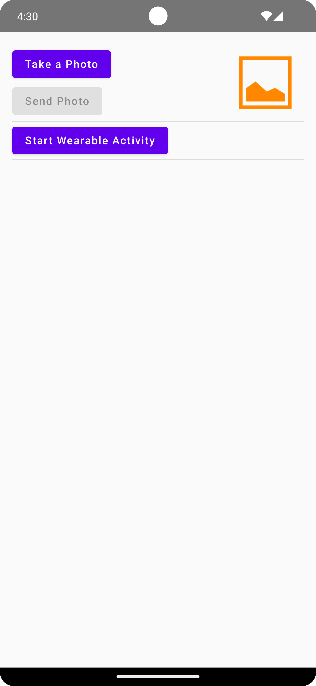

Android DataLayer Sample
========================

This sample demonstrates how to work with a WearableListenerService,
to produce and consume DataEvents and effectively work with the DataLayer.

Introduction
------------

This sample demonstrates how to make a handheld and an Wear device communicate
using the [DataClient][2].
It does this by sending a picture between connected devices.

An Activity is being used for both the connected devices which implement their parts of
the required interfaces using Jetpack Compose.

It showcases how to use an [WearableListenerService][1] to consume DataEvents
as well as implementations for various required listeners when using the [DataClient][2],
[MessageClient][3] and [NodeClient][4].

[1]: https://developers.google.com/android/reference/com/google/android/gms/wearable/WearableListenerService
[2]: https://developers.google.com/android/reference/com/google/android/gms/wearable/DataClient
[3]: https://developers.google.com/android/reference/com/google/android/gms/wearable/MessageClient
[4]: https://developers.google.com/android/reference/com/google/android/gms/wearable/NodeClient

Pre-requisites
--------------

- Android SDK 32

Screenshots
-------------

  

Getting Started
---------------

This sample uses the Gradle build system. To build this project, use the
"gradlew build" command or use "Import Project" in Android Studio.

Support
-------

- Stack Overflow: http://stackoverflow.com/questions/tagged/android

If you've found an error in this sample, please file an issue in the issue tracker.

Patches are encouraged, and may be submitted by forking this project and
submitting a pull request through GitHub. Please see CONTRIBUTING.md for more details.
