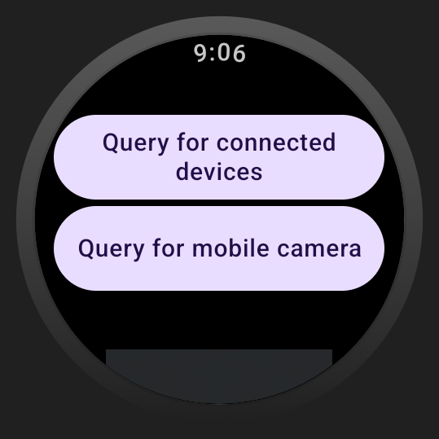

Android DataLayer Sample
========================

This sample demonstrates how to work with a WearableListenerService using:

- [DataClient][2] to exchange data events
- [MessageClient][3] to send messages
- [CapabilityClient][4] to find nodes with specific capabilities


Introduction
------------

This sample showcases how a phone and a Wear OS app can exchange data. It implements 3 use cases:

1. Send a data asset from the phone to the watch
In the sample you can take a photo on the phone and send it to the paired watch. The photo is sent 
as a [DataAsset][6] by using [DataClient][2].
```
val request = PutDataMapRequest.create(IMAGE_PATH).apply {
  dataMap.putAsset(IMAGE_KEY, imageAsset)
  dataMap.putLong(TIME_KEY, Instant.now().epochSecond)
  }
  .asPutDataRequest()
  .setUrgent()

  val result = dataClient.putDataItem(request).await()
```
This use case is successful if the watch is connected and has the Wear app 
installed which is implemented by using [CapabilityClient][4].
2. Send data from the phone to the watch and ackownledge via a message
The phone app increments a counter and send it over a period of 5 seconds as a [DataItem] by using [DataClient][2].
The Wear app receives the [DataItem][5] by implementing a [WearableListenerService][1] and acknowledge 
by sending a [Message] via [MessageClient][3]
```
messageClient.sendMessage(
  nodeId,
  DATA_ITEM_RECEIVED_PATH,
  payload
)
.await()
```
3. Launch the Wear app from the phone app
The phone app checks if there is a connected node with a specific capability that identifies the
correspondent Wear app. The capability is declared in the wear.xml file:
```
<string-array name="android_wear_capabilities" tools:ignore="UnusedResources" translatable="false">
  <!-- declaring the provided capabilities -->
  <item>wear</item>
```
Then the phone app sends a message to the Wear app by specifying the node id of the device and
the path of the activity.
```
nodes.map { node ->
  async {
    messageClient.sendMessage(node.id, START_ACTIVITY_PATH, byteArrayOf())
      .await()
    }
}.awaitAll()
```
The Wearable app is listening to events by implementing a [WearableListenerService][1] an upon receiving 
the message starts the Activity.

This samples is useful to learn about how to use the Wearable API clients and WearableListenerService. 
Alternatively Horologist provides some API which facilitates some use cases such as like:

- [Installing][7] the Wear app on another connected device by opening the Playstore app on the phone
- [Starting][8] the Wear app on another connected device
- [Finishing sign-in][9] the Wear app on another connected device
- [Installing a Wear Tile][10] from the phone by redirecting to the Tile settings editor screen (supported only on 
some devices)
- [Persisting data on the DataStore and model as a proto][11]
- Check if the [Wearable API is supported][12] on mobile
- Find [connected nodes and understand if the app is already installed][13]

[1]: https://developers.google.com/android/reference/com/google/android/gms/wearable/WearableListenerService
[2]: https://developers.google.com/android/reference/com/google/android/gms/wearable/DataClient
[3]: https://developers.google.com/android/reference/com/google/android/gms/wearable/MessageClient
[4]: https://developers.google.com/android/reference/com/google/android/gms/wearable/CapabilityClient
[5]: https://developers.google.com/android/reference/com/google/android/gms/wearable/DataItem
[6]: https://developers.google.com/android/reference/com/google/android/gms/wearable/DataAsset
[7]: https://google.github.io/horologist/datalayer-phone-ui/#install-app
[8]: https://google.github.io/horologist/datalayer-phone-ui/#reengage-prompt
[9]: https://google.github.io/horologist/datalayer-phone-ui/#signin-prompt
[10]: https://google.github.io/horologist/datalayer-phone-ui/#install-tile-prompt
[11]: https://google.github.io/horologist/datalayer/
[12]: https://google.github.io/horologist/datalayer-helpers-guide/#check-api-availability
[13]: https://google.github.io/horologist/datalayer-helpers-guide/#connection-and-installation-status

Pre-requisites
--------------

- Android SDK 32

Screenshots
-------------

  

Getting Started
---------------

This sample uses the Gradle build system. To build this project, use the
"gradlew build" command or use "Import Project" in Android Studio.

Support
-------

- Stack Overflow: https://stackoverflow.com/questions/tagged/wear-os

If you've found an error in this sample, please file an issue in the issue tracker.

Patches are encouraged, and may be submitted by forking this project and
submitting a pull request through GitHub. Please see CONTRIBUTING.md for more details.
