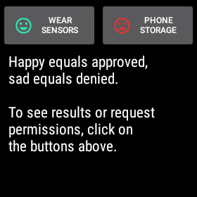
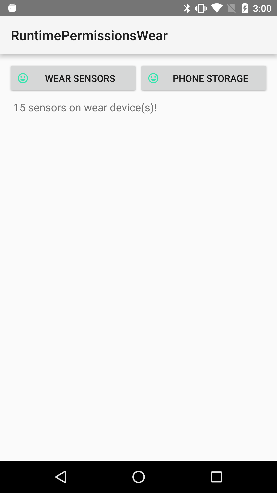

Android RuntimePermissionsWear Sample
=====================================

A sample that shows how you can handle remote data that requires permissions both on
a wearable device and a mobile device.

Introduction
------------

Steps for trying out this sample:
* Compile and install the mobile app onto your mobile device or emulator.
* Compile and install the wearable app onto your Wear device or emulator.
(**Note:** wearable apps are not automatically pushed from your mobile device
unless you build a production release, see [here][3] for more info).
* Start the mobile or wear app. Each app contains two buttons: one for showing
local data and another for showing remote data.
* Click either button to view the data. Both local and remote data require
[dangerous permissions][4] to be approved before displaying the data for
devices running 23 or above. You will be asked to approve the access if you
do not have the proper permissions.
* The happy icon signifies you have access to the data while the sad icon
signifies you do or may not have access (and may be asked to approve access).

This sample demonstrates how to access data and trigger permission approval
on remote devices. It uses [Services][5] and the [Wearable MessageApi][2] to
communicate between devices.

To find out more about wear, visit our [developer Wear page][1].

[1]: http://developer.android.com/wear/
[2]: https://developer.android.com/reference/com/google/android/gms/wearable/MessageApi.html
[3]: https://developer.android.com/training/wearables/apps/creating.html#Install
[4]: http://developer.android.com/guide/topics/security/permissions.html#normal-dangerous
[5]: http://developer.android.com/guide/components/services.html

Pre-requisites
--------------

- Android SDK 28
- Android Build Tools v29.0.2
- Android Support Repository

Screenshots
-------------

  

Getting Started
---------------

This sample uses the Gradle build system. To build this project, use the
"gradlew build" command or use "Import Project" in Android Studio.

Support
-------

- Stack Overflow: https://stackoverflow.com/questions/tagged/wear-os

If you've found an error in this sample, please file an issue:
https://github.com/googlesamples/android-RuntimePermissionsWear

Patches are encouraged, and may be submitted by forking this project and
submitting a pull request through GitHub. Please see CONTRIBUTING.md for more details.
