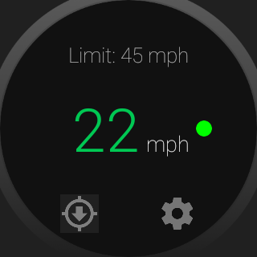
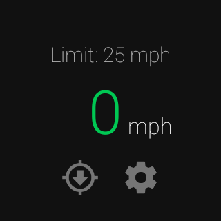

Android SpeedTracker Sample
===========================

Sample demonstrates recording location and speed with a Wear device in mind. Location is
            retrieved via FusedLocatinProvider which retrieves coordinates from the phone or Wear
            depending on whether the phone is disconnected or not and whether the Wear device has a
            GPS chip.

Introduction
------------

Steps for trying out this sample:
* Compile and install the mobile app onto your mobile device or emulator.
* Compile and install the wearable app onto your Wear device or emulator.
(**Note:** wearable apps are not automatically pushed from your mobile device
unless you build a production release, see [here][1] for more info).

Sample demonstrates retrieving location and speed samples on Wear using the FusedLocationProvider.
It also passes GPS location information back to the mobile device via the Data Layer to be rendered
on a Map Fragment.

[1]: https://developer.android.com/training/wearables/apps/creating.html#Install

Pre-requisites
--------------

- Android SDK 28
- Android Build Tools v29.0.2
- Android Support Repository

Screenshots
-------------

 

Getting Started
---------------

This sample uses the Gradle build system. To build this project, use the
"gradlew build" command or use "Import Project" in Android Studio.

Support
-------

- Google+ Community: https://plus.google.com/communities/105153134372062985968
- Stack Overflow: http://stackoverflow.com/questions/tagged/android

If you've found an error in this sample, please file an issue:
https://github.com/googlesamples/android-SpeedTracker

Patches are encouraged, and may be submitted by forking this project and
submitting a pull request through GitHub. Please see CONTRIBUTING.md for more details.
