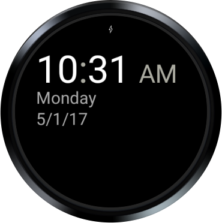
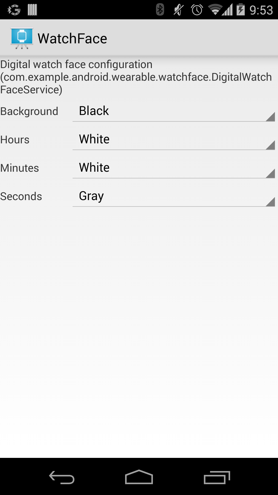
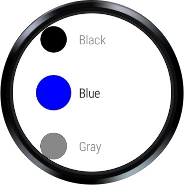
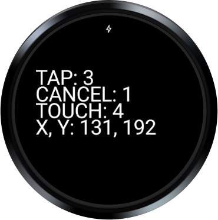
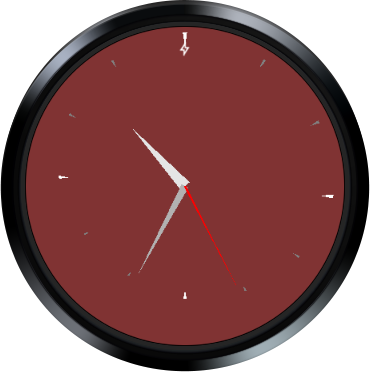

Android WatchFace Sample
========================

A simple sample that demonstrates watch faces and complications for Wear 2.0.

Introduction
------------

This sample demonstrates how to create watch faces for Wear.

The analog watch face covers best practices for Wear 2.0 including complications and a new
configuration Activity for configuring both the watch face styles and the complications themselves.
We recommend you reuse the configuration code and follow the UX patterns in your watch face's
configuration activity. You can see a preview in the screenshots section of the README.

The analog watch face has three main classes:

- AnalogComplicationWatchFaceService.java (watchface folder) - Renders the watch face and active
complications.

- AnalogComplicationConfigActivity.java (config folder) - Allows user to adjust watch face settings
(arm and background colors) and watch face complications.

- AnalogComplicationConfigData.java (models folder) - Populates the configuration screen in the
previous step by returning a list of items. Each item represents something you can customize on the
watch face. Items include a preview of the watch face (where you can pick your complications),
marker color, background color, unread notifications, and background image complication. You can
extend this and add your own.

We include several older watch faces to show best practices for Wear 1.0. If you are targeting
older devices, you may want to review those watch faces (digital, opengl, and interactive).

The digital watch face includes a watch-side and phone-side configuration example.

This sample includes both a phone app and a wearable app.

Because watch face apps do not have a default Activity in their project, you will need to set your
Configurations to "Do not launch Activity" for both the Wear and Application modules. If you are
unsure how to do this, please review the "Run Starter project" section in the
[Google Watch Face Code Lab][1].

Steps to build in Android Studio
--------------------------------
Once the project is open, edit run configurations -> General -> Launch Options -> Launch: Nothing
this will allow runs.

[1]: https://codelabs.developers.google.com/codelabs/watchface/index.html

Pre-requisites
--------------

- Android SDK 28
- Android Build Tools v29.0.2
- Android Support Repository

Screenshots
-------------

         

Getting Started
---------------

This sample uses the Gradle build system. To build this project, use the
"gradlew build" command or use "Import Project" in Android Studio.

Support
-------

- Google+ Community: https://plus.google.com/communities/105153134372062985968
- Stack Overflow: http://stackoverflow.com/questions/tagged/android

If you've found an error in this sample, please file an issue:
https://github.com/googlesamples/android-WatchFace

Patches are encouraged, and may be submitted by forking this project and
submitting a pull request through GitHub. Please see CONTRIBUTING.md for more details.
