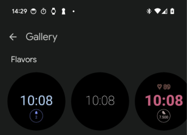
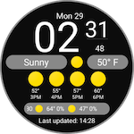

# Watch Face Format Sample

A sample demonstrating the structure of Watch Face Format watch faces

## Introduction

The Watch Face Format (WFF) allows developers to build watch faces, and watch
face design tools in a XML format.

This sample demonstrates the basic structure of a WFF watch face, and how it
should be packaged for uploading to Play or for local testing on an emulator or
device.

For more details on the Watch Face Format, see:

- [Watch Face Format overview][wff-overview]
- [Watch Face Format setup][wff-setup]
- [XML reference][wff-xml-reference]
- [Design guidance][watch-face-design-guidance]
- [Validator tools and Schema][validator-tools]

## Samples

There are currently seven samples available:

- `SimpleDigital` - A basic digital watch face.
- `SimpleAnalog` - A basic analog watch face.
- `Complications` - Demonstrates using Complications in a watch face and
  rendering data from Complication data sources.
- `Flavors` - Demonstrates [Flavors][flavors], a version 2 feature of the Watch
Face Format.



- `Weather` - Current, hourly and daily [weather data][weather] in the Watch
Face Format. Weather is also a version 2 feature.



- `PhotosMask` and `PhotosMulti` - demonstrating the photos function introduced
in Wear OS 6.

## Building the samples

Use Gradle to build each of the samples. For example, to build the
`SimpleDigital` debug build:

```shell
cd SimpleDigital
./gradlew assembleDebug
```

Additional commands that you can run from the command-line:

- `./gradlew validateWff` - This only validates the WFF XML files, but will not build the APK. This task is automatically run as part of `assembleDebug` and
  `bundleDebug`.
- `./gradlew memoryFootprint`- this runs the [memory footprint evaluator][validator-tools] on the resulting package.
- `./gradlew validateWffAndInstall [--device <deviceid>]` - builds and validates the watch face, then installs and sets on a connected device or emulator.

For more guidance on building and signing release builds, see
[signing guidance][signing] on developer.android.com

## Debugging

1. Use the [XML validator][validator-tools] to confirm that the XML in
   `watchface.xml` is valid.
1. Use `logcat` to look for any error messages from the WFF runtime, such as
   potential errors in WFF expressions.

   ```shell
   adb logcat --pid=$(adb shell pidof -s com.google.wear.watchface.runtime)
   ```

## Support

- Stack Overflow: <https://stackoverflow.com/questions/tagged/wear-os>
- Error Reporting: If you've found an error in this sample, please file an
  issue: <https://github.com/android/wear-os-samples>
- Submitting Patches: Patches are encouraged, and may be submitted by forking
  this project and submitting a pull request through GitHub. Please see
  [CONTRIBUTING.md][contributing] for more details.

[wff-overview]: https://developer.android.com/training/wearables/wff
[wff-setup]: https://developer.android.com/training/wearables/wff/setup
[wff-xml-reference]: https://developer.android.com/training/wearables/wff/watch-face
[watch-face-design-guidance]: https://developer.android.com/design/ui/wear/guides/surfaces/watch-faces
[contributing]: ../CONTRIBUTING.md
[validator-tools]: https://github.com/google/watchface
[signing]: https://developer.android.com/build/building-cmdline#gradle_signing
[flavors]: https://developer.android.com/training/wearables/wff/user-configuration/flavor
[weather]: https://developer.android.com/training/wearables/wff/weather
[wear_5_emulator]: https://developer.android.com/training/wearables/versions/5
