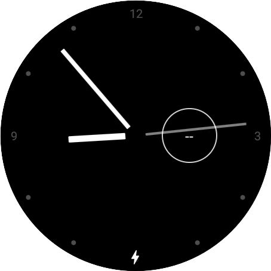
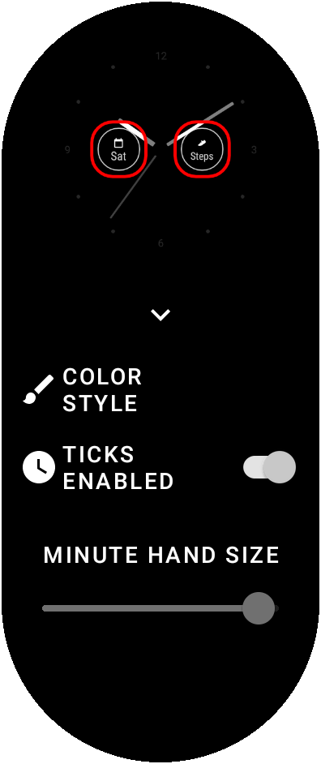
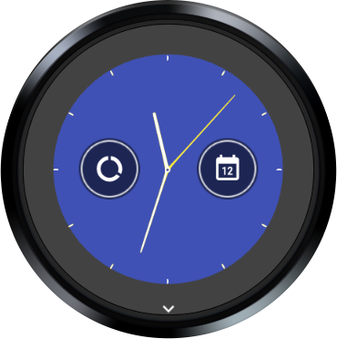
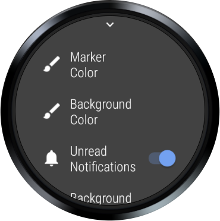

WatchFace Sample (Kotlin)
===============================
Demonstrates watch faces using the new androidX libraries (Kotlin).

Introduction
------------
With the release of the androidX watch face libraries (late 2020), Wear OS has simplified
watch face development.

This sample gives you an early preview of how you can simplify your development with the new 100%
Kotlin libraries.

Steps to build in Android Studio
--------------------------------
Because a watch face only contains a service, that is, there is no Activity, you first need to turn
off the launch setting that opens an Activity on your device.

To do that (and once the project is open) go to Run -> Edit Configurations. Select the **app**
module and the **General** tab. In the Launch Options, change **Launch:** to **Nothing**. This will
allow you to successfully install the watch face on the Wear device.

When installed, you will need to select the watch face in the watch face picker, i.e., the watch
face will not launch on its own like a regular app.

For more information, check out our code lab:
[1]: https://codelabs.developers.google.com/codelabs/watchface/index.html

Screenshots
-------------

Getting Started
---------------

This sample uses the Gradle build system. To build this project, use the "gradlew build" command or
use "Import Project" in Android Studio.

Support
-------

- Stack Overflow: https://stackoverflow.com/questions/tagged/wear-os

If you've found an error in this sample, please file an issue:
https://github.com/android/wear-os-samples

Patches are encouraged, and may be submitted by forking this project and
submitting a pull request through GitHub. Please see CONTRIBUTING.md for more details.
