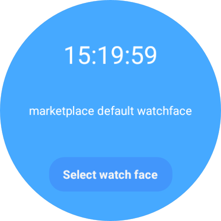

Watch Face Push sample
======================
Demonstrates using the Watch Face Push API on Wear OS.

Introduction
------------

The [Watch Face Push API][wfp-guide] enables you to build watch face marketplace apps on Wear OS. The API
is available on Wear OS devices running Wear OS 6+.

For more details on Watch Face Push, see the [Developer Guide][wfp-guide] or the
[reference documentation][wfp-docs].



Getting Started
---------------

This sample uses the Gradle build system. To build this project, either build at the command-line:

```shell
./gradlew :app:installDebug
```

or open in Android Studio to build and deploy from there.

Support
-------

- Stack Overflow: https://stackoverflow.com/questions/tagged/wear-os

If you've found an error in this sample, please [create an issue](https://github.com/android/wear-os-samples/issues/new).

Patches are encouraged, and may be submitted by forking this project and
submitting a pull request through GitHub. Please see CONTRIBUTING.md for more details.

[wfp-guide]: https://developer.android.com/training/wearables/watch-face-push
[wfp-docs]: https://developer.android.com/reference/kotlin/androidx/wear/watchface/push/package-summary