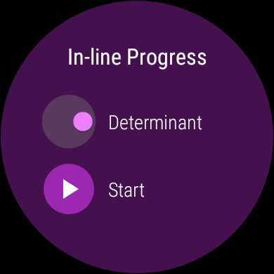
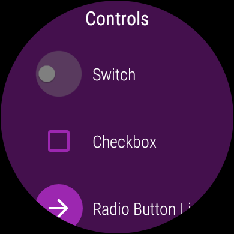

Android WearAccessibilityApp Sample
===================================

Sample demonstrates how to include accessibility support for your wearable app.

Introduction
------------

Accessibility is an important part of any app (especially wearable apps). By
            integrating accessible components and services, you can improve your app's usability,
            particularly for users with disabilities.

            This sample demonstrates common UX patterns in wearable apps along with accessibility
            support of those patterns. Be sure to review the [Accessibility Developer Checklist][1]
            for your own app. For additional information please see our
            [Best Practices for User Interface][2] page.

            [1]: https://developer.android.com/guide/topics/ui/accessibility/checklist.html
            [2]: https://developer.android.com/training/accessibility/index.html

Pre-requisites
--------------

- Android SDK 28
- Android Build Tools v28.0.3
- Android Support Repository

Screenshots
-------------

   

Getting Started
---------------

This sample uses the Gradle build system. To build this project, use the
"gradlew build" command or use "Import Project" in Android Studio.

Support
-------

- Google+ Community: https://plus.google.com/communities/105153134372062985968
- Stack Overflow: http://stackoverflow.com/questions/tagged/android

If you've found an error in this sample, please file an issue:
https://github.com/googlesamples/android-WearAccessibilityApp

Patches are encouraged, and may be submitted by forking this project and
submitting a pull request through GitHub. Please see CONTRIBUTING.md for more details.
