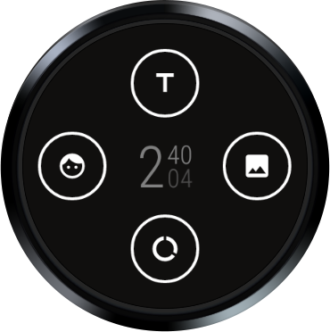

Android WearComplicationProvidersTestSuite Sample
=================================================

Complication Test Suite is a set of complication providers that provide dummy data and it can be
used to test how different types of complications render on a watch face.

Introduction
------------

Steps for trying out the sample:
* Compile and install the wearable app onto your Wear device or emulator (for Wear scenario).

* This sample does not have a main Activity (just Services that provide the complication data).
Therefore, you may see an error next to the 'Run' button. To fix, click on the
"Wearable" dropdown next to the 'Run' button and select 'Edit Configurations'. Under the
'Launch Options', change the 'Launch' field from 'Default APK' to 'Nothing' and save.

This sample provides dummy data for testing the complications UI in your watch face. To 
select the type of complication you want to use on your watch face, either double-tap the complication (emulator) or long-press the complication (on a Wear 3 device) to access complication settings. Choose the type of complication you would like from the WearComplicationProviderTestSuite provider's list. Once you choose the complication type(s) you would like, you can tap on the complications to see more options.

The Wear app demonstrates the use of [ComplicationData][1], [ComplicationManager][2],
[ComplicationProviderService][3], [ComplicationText][4], and [ProviderUpdateRequester][5].

[1]: https://developer.android.com/reference/android/support/wearable/complications/ComplicationData.html
[2]: https://developer.android.com/reference/android/support/wearable/complications/ComplicationManager.html
[3]: https://developer.android.com/reference/android/support/wearable/complications/ComplicationProviderService.html
[4]: https://developer.android.com/reference/android/support/wearable/complications/ComplicationText.html
[5]: https://developer.android.com/reference/android/support/wearable/complications/ProviderUpdateRequester.html

Pre-requisites
--------------

- Android SDK 28
- Android Build Tools v29.0.2
- Android Support Repository

Screenshots
-------------

  

Getting Started
---------------

This sample uses the Gradle build system. To build this project, use the
"gradlew build" command or use "Import Project" in Android Studio.

Support
-------

- Stack Overflow: http://stackoverflow.com/questions/tagged/android

If you've found an error in this sample, please file an issue:
https://github.com/googlesamples/android-WearComplicationProvidersTestSuite

Patches are encouraged, and may be submitted by forking this project and
submitting a pull request through GitHub. Please see CONTRIBUTING.md for more details.
