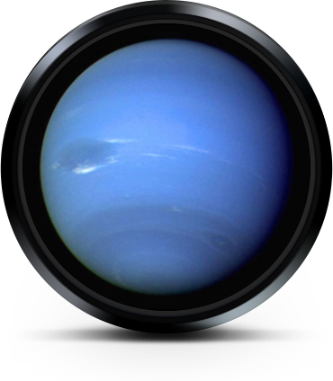
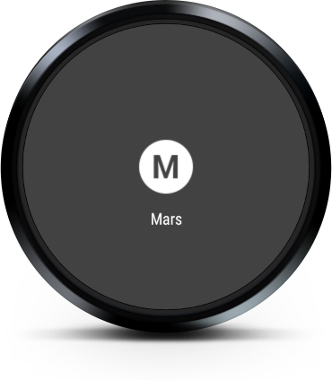
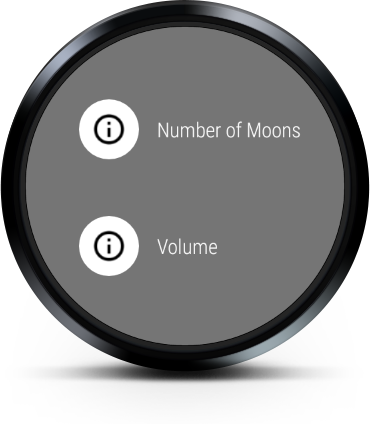

Android WearDrawers Sample
===================================

A simple sample that demonstrates Navigation and Action Drawers, part of Material Design for Wear.

Introduction
------------

Steps for trying out this sample:

            * Compile and install the wearable app onto your Wear device or emulator.
            (**Note:** You must install this app directly to your Wear device or emulator.
            If installed on a phone, it will not be automatically pushed to a paired Wear
            device, see [here][2] for more info).

            This sample uses the planets in our solar system to demonstrate the two Wear
            drawer components and concepts relating to [Wear][1] and [Material Design][3]:
            * Customizes and enables screen/planet changes with the [Navigation Drawer][4]
            * Adds customized actions to each screen using the [Action Drawer][5]

            [1]: http://developer.android.com/wear/
            [2]: https://developer.android.com/training/wearables/apps/creating.html#Install
            [3]: http://www.google.com/design/wear
            [4]: http://www.google.com/design/spec-wear/components/navigation-drawer.html
            [5]: http://www.google.com/design/spec-wear/components/action-drawer.html

Pre-requisites
--------------

- Android SDK 28
- Android Build Tools v28.0.3
- Android Support Repository

Screenshots
-------------

    

Getting Started
---------------

This sample uses the Gradle build system. To build this project, use the
"gradlew build" command or use "Import Project" in Android Studio.

Support
-------

- Google+ Community: https://plus.google.com/communities/105153134372062985968
- Stack Overflow: http://stackoverflow.com/questions/tagged/android

If you've found an error in this sample, please file an issue:
https://github.com/googlesamples/android-WearDrawers

Patches are encouraged, and may be submitted by forking this project and
submitting a pull request through GitHub. Please see CONTRIBUTING.md for more details.

License
-------

Copyright 2019 The Android Open Source Project, Inc.

Licensed to the Apache Software Foundation (ASF) under one or more contributor
license agreements.  See the NOTICE file distributed with this work for
additional information regarding copyright ownership.  The ASF licenses this
file to you under the Apache License, Version 2.0 (the "License"); you may not
use this file except in compliance with the License.  You may obtain a copy of
the License at

http://www.apache.org/licenses/LICENSE-2.0

Unless required by applicable law or agreed to in writing, software
distributed under the License is distributed on an "AS IS" BASIS, WITHOUT
WARRANTIES OR CONDITIONS OF ANY KIND, either express or implied.  See the
License for the specific language governing permissions and limitations under
the License.
