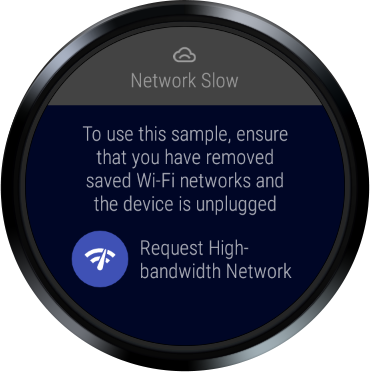
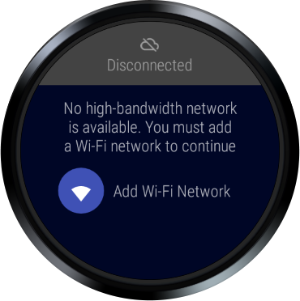
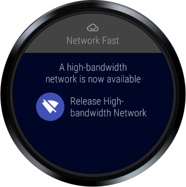

Android WearHighBandwidthNetworking Sample
===================================

Sample demonstrates how to determine if a high-bandwidth network is available for use cases that
require a minimum network bandwidth, such as streaming media or downloading large files. In
addition, the sample demonstrates best practices for asking a user to add a new Wi-Fi network for
high-bandwidth network operations if the bandwidth of currently available networks is inadequate.

Introduction
------------

On Wear, a high-bandwidth network is not always available, as the platform manages
network connectivity with the goal of providing the best overall user experience, balancing network
bandwidth and maximizing device battery life. For use cases that require high-bandwidth network
access, such as transporting large files or streaming media, we recommend that apps:

1. Check for an active network, and if there is one, check its bandwidth.
2. If there isn't an active network, or its bandwidth is insufficient, request access to an
unmetered Wi-Fi or cellular network.
3. If a high-bandwidth network is still not avaiable, ask the user to connect to a new Wi-Fi
network.

You can use the [ConnectivityManager][1] class to check if an active network exists, if the active
network has sufficient bandwidth for the desired network operation, and to request an appropriate
high-bandwidth network.

In addition to requesting a high-bandwidth network, you should also ensure that you are releasing
bound networks and cancelling any ongoing network requests when they are no longer needed.

This sample demonstrates all aspects of testing, requesting, and releasing network resources to
ensure a high-bandwidth network is available. In addition, the sample demonstrates the ideal user
experience for guiding the user through the process of acquiring a high-bandwidth network.

To try all aspects of this sample, ensure that you have removed all saved Wi-Fi networks from your
Wear device and that it is unplugged, as Wear devices may prefer high-bandwidth networks by default
while plugged-in. Also, you may wish to put your phone in airplane mode or turn off Bluetooth to
simulate the Wear device running standalone.

[1]: https://developer.android.com/reference/android/net/ConnectivityManager.html

Pre-requisites
--------------

- Android SDK 28
- Android Build Tools v28.0.3
- Android Support Repository

Screenshots
-------------

   

Getting Started
---------------

This sample uses the Gradle build system. To build this project, use the
"gradlew build" command or use "Import Project" in Android Studio.

Support
-------

- Google+ Community: https://plus.google.com/communities/105153134372062985968
- Stack Overflow: http://stackoverflow.com/questions/tagged/android

If you've found an error in this sample, please file an issue:
https://github.com/googlesamples/android-WearHighBandwidthNetworking

Patches are encouraged, and may be submitted by forking this project and
submitting a pull request through GitHub. Please see CONTRIBUTING.md for more details.

License
-------

Copyright 2019 The Android Open Source Project, Inc.

Licensed to the Apache Software Foundation (ASF) under one or more contributor
license agreements.  See the NOTICE file distributed with this work for
additional information regarding copyright ownership.  The ASF licenses this
file to you under the Apache License, Version 2.0 (the "License"); you may not
use this file except in compliance with the License.  You may obtain a copy of
the License at

http://www.apache.org/licenses/LICENSE-2.0

Unless required by applicable law or agreed to in writing, software
distributed under the License is distributed on an "AS IS" BASIS, WITHOUT
WARRANTIES OR CONDITIONS OF ANY KIND, either express or implied.  See the
License for the specific language governing permissions and limitations under
the License.
