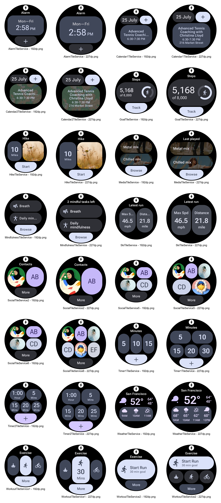

Wear Tiles Sample
=================

[Tiles](https://d.android.com/training/wearables/tiles) provide easy access to
the information and actions users need in order to get things done. With a
simple swipe from the watch face, a user can find out the latest forecast or
start a timer.

This repository contains a sample tile built using the [Tiles Material
Components](https://developer.android.com/reference/androidx/wear/protolayout/material/package-summary)
library (for UI) and [Horologist
Tiles](https://github.com/google/horologist#-tiles) (preview utilities and
Kotlin-friendly wrappers).

Get Started
-----------

Build the project from the command line using `./gradlew build` or import it
into Android Studio to benefit from the IDE shortcuts like direct surface
launching which lets you launch the Messaging tile directly to a device or
emulator in just one click.

For the sample, start with
[`Service.kt`](app/src/main/java/com/example/wear/tiles/messaging/Service.kt);
the layout (with IDE preview) can be found in
[`Layout.kt`](app/src/main/java/com/example/wear/tiles/messaging/Layout.kt).

Golden Tiles
------------

The sample also showcases many of the Tile layout examples from the [Tiles Design
Kit](https://developer.android.com/training/wearables/design/tiles-design-system#tile-templates);
see [`GoldenTiles.kt`](app/src/debug/java/com/example/wear/tiles/golden/GoldenTiles.kt)).
You may find it convenient to start with one of these layouts rather than designing and coding
your own from scratch.

Support
-------

- Stack Overflow: <https://stackoverflow.com/questions/tagged/wear-os>

If you've found an error in this sample, please file an issue:
<https://github.com/android/wear-os-samples>

Patches are encouraged, and may be submitted by forking this project and
submitting a pull request through GitHub. Please see CONTRIBUTING.md for more details.
