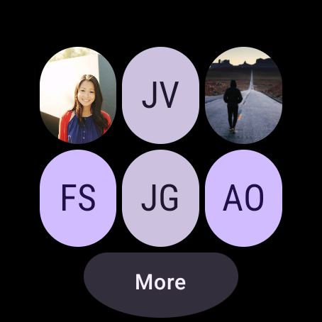
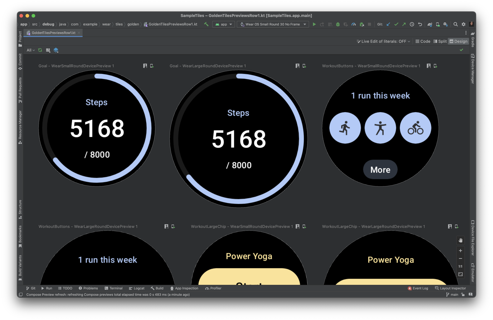
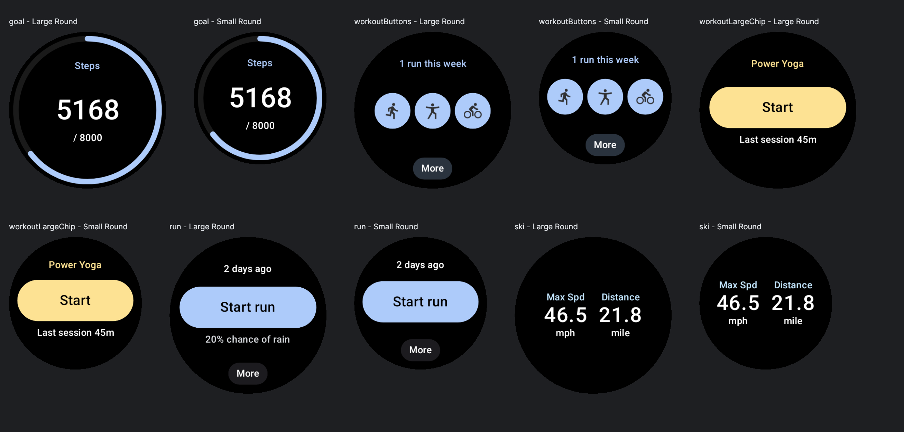
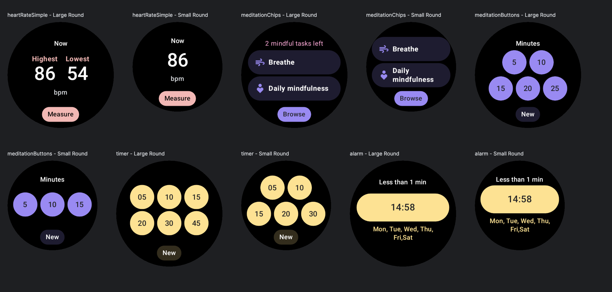
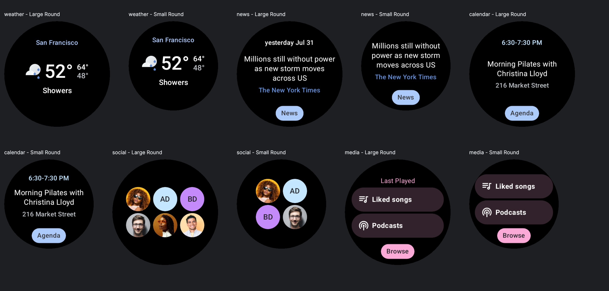

Wear Tiles Sample
=================



[Tiles](https://d.android.com/training/wearables/tiles) provide easy access to
the information and actions users need in order to get things done. With a
simple swipe from the watch face, a user can find out the latest forecast or
start a timer.

This repository contains a sample tile built using the [Tiles Material
Components](https://developer.android.com/reference/androidx/wear/protolayout/material/package-summary)
library (for UI) and [Horologist
Tiles](https://github.com/google/horologist#-tiles) (preview utilities and
Kotlin-friendly wrappers).

Get Started
-----------

Build the project from the command line using `./gradlew build` or import it
into Android Studio to benefit from the IDE shortcuts like direct surface
launching which lets you launch the Messaging tile directly to a device or
emulator in just one click.

For the sample, start with
[`Service.kt`](app/src/main/java/com/example/wear/tiles/messaging/Service.kt);
the layout (with IDE preview) can be found in
[`Layout.kt`](app/src/main/java/com/example/wear/tiles/messaging/Layout.kt).

Golden Tiles
------------

Note: these have not yet been updated to [Material 3
Expressive](https://developer.android.com/design/ui/wear/guides/surfaces/tiles).

The sample also showcases most of the Golden Tile layouts from the [Tiles Design
Kit](https://developer.android.com/training/wearables/design/tiles-design-system#tile-templates)
in the `tiles.golden` package of the `debug` sourceset; see
`GoldenTilesPreviewsRow[N].kt`. You may find it convenient to start with one of
these layouts rather designing and coding your own from scratch.

To see what these look like, open one of the "GoldenTilesPreviewsRowN" files and
choose the "Split" or "Design" editor view.



`GoldenTilesPreviewsRow1.kt`:



`GoldenTilesPreviewsRow2.kt`:



`GoldenTilesPreviewsRow3.kt`:



MCP (Experimental)
------------------

A simple MCP server for controlling attached devices via `adb` is included in
the [.gemini/extensions/wear](.gemini/extensions/wear) directory.

To use it via the [Gemini CLI](https://github.com/google-gemini/gemini-cli),
first ensure a recent version of [NodeJs](https://nodejs.org/en) is installed,
then:

```sh
# Install dependencies
$ npm install --prefix .gemini/extensions/wear
# Ensure ANDROID_SERIAL is set to the id to an attached device (see `adb devices -l`)
$ export ANDROID_SERIAL=emulator-5556
# Run gemini
$ gemini
```

See the [`README`](.gemini/extensions/wear/README.md) for more information.

Support
-------

- Stack Overflow: <https://stackoverflow.com/questions/tagged/wear-os>

If you've found an error in this sample, please file an issue:
<https://github.com/android/wear-os-samples>

Patches are encouraged, and may be submitted by forking this project and
submitting a pull request through GitHub. Please see CONTRIBUTING.md for more details.
