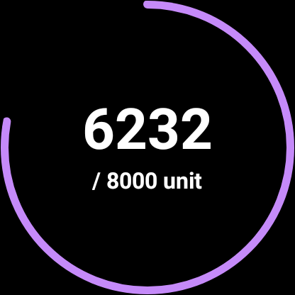
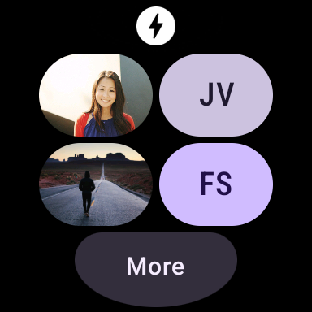

Wear Tiles Sample
===============================
Demonstrates tiles using the new AndroidX alpha library.

Introduction
------------

[Tiles](https://d.android.com/training/articles/wear-tiles) provide users with swipeable access
to the things they need to know and get done right from their wrist. They are fast to access and
convenient, designed to provide users with what they need in the moment, which gives users control
over what information and actions they want to see.

This repository contains a set of sample implementations of Tiles, demonstrating various use cases.
Each Tile extends TileProviderService and implements onTileRequest and onResourcesRequest.

Screenshots
-------------

  

Getting Started
---------------

This sample uses the Gradle build system. To build this project, use the "gradlew build" command or
use "Import Project" in Android Studio.

Support
-------

- Stack Overflow: http://stackoverflow.com/questions/tagged/android

If you've found an error in this sample, please file an issue:
https://github.com/android/wear-os-samples

Patches are encouraged, and may be submitted by forking this project and
submitting a pull request through GitHub. Please see CONTRIBUTING.md for more details.
