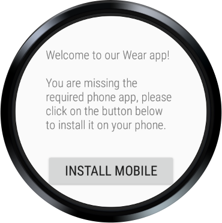
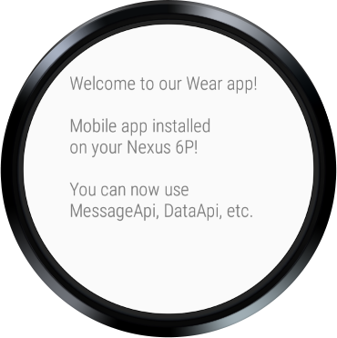
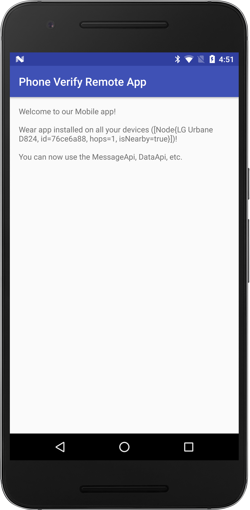

Android WearVerifyRemoteApp Sample
===================================

Sample demonstrates best practices for checking if connected mobile device has your app installed
from a Wear 2.+ standalone app and the other way around.

Introduction
------------

Steps for trying out the sample:
* Compile and install the mobile app onto your mobile device or emulator (for mobile
scenario).
* Compile and install the wearable app onto your Wear device or emulator (for Wear
scenario).

This sample demonstrate best practices for using PlayStoreAvailability and RemoteIntent to check
if the mobile version of your app exists from within your Standalone Wear 2.+ app and the other
way around. Scenarios:

1. Launch Wear standalone app to verify if the mobile version is installed. If it is not, you will
be able to open the Play Store on the remote mobile device from the app (if it has the Play Store).

2. Launch Mobile app to verify if the Wear version is installed. If it is not, you will
be able to open the Play Store on the remote Wear device from the app.

Although there are two apps (Mobile and Wear), each should be looked at as a separate, standalone
apps/experiences.

Pre-requisites
--------------

- Android SDK 28
- Android Build Tools v28.0.3
- Android Support Repository

Screenshots
-------------

    

Getting Started
---------------

This sample uses the Gradle build system. To build this project, use the
"gradlew build" command or use "Import Project" in Android Studio.

Support
-------

- Google+ Community: https://plus.google.com/communities/105153134372062985968
- Stack Overflow: http://stackoverflow.com/questions/tagged/android

If you've found an error in this sample, please file an issue:
https://github.com/googlesamples/android-WearVerifyRemoteApp

Patches are encouraged, and may be submitted by forking this project and
submitting a pull request through GitHub. Please see CONTRIBUTING.md for more details.

License
-------

Copyright 2019 The Android Open Source Project, Inc.

Licensed to the Apache Software Foundation (ASF) under one or more contributor
license agreements.  See the NOTICE file distributed with this work for
additional information regarding copyright ownership.  The ASF licenses this
file to you under the Apache License, Version 2.0 (the "License"); you may not
use this file except in compliance with the License.  You may obtain a copy of
the License at

http://www.apache.org/licenses/LICENSE-2.0

Unless required by applicable law or agreed to in writing, software
distributed under the License is distributed on an "AS IS" BASIS, WITHOUT
WARRANTIES OR CONDITIONS OF ANY KIND, either express or implied.  See the
License for the specific language governing permissions and limitations under
the License.
