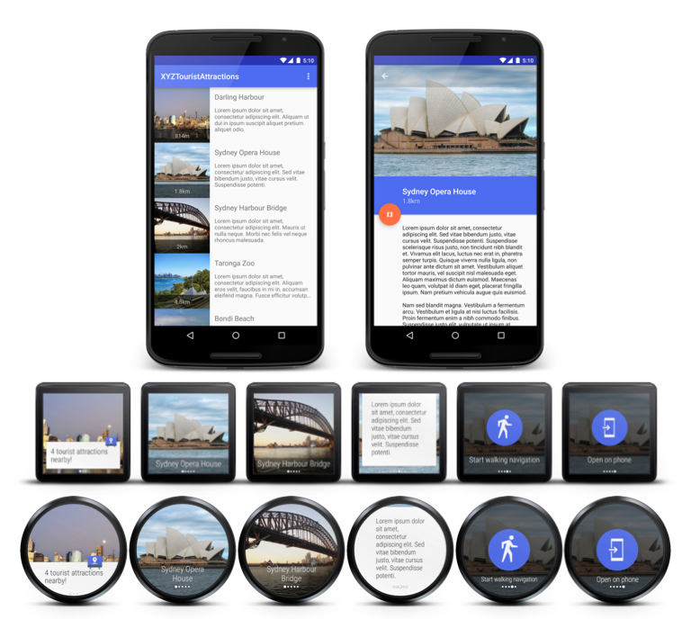

Android XYZTouristAttractions Sample
===================================

This sample aims to be as close to a real world example of a mobile
and Wear app combination as possible. It has a more refined design
and also provides a practical example of how a mobile app would
interact and communicate with its wear counterpart.

The app itself is modeled after a hypothetical tourist attractions
app that notifies the user when they are in close proximity to
notable points of interest.

The Wear component shows tourist attraction images and summary
information, and provides quick actions for nearby tourist
attractions in a [GridViewPager](http://developer.android.com/reference/android/support/wearable/view/GridViewPager.html)
UI component.

Introduction
------------

Steps for trying out this sample:
* Compile and install the mobile app onto your mobile device or emulator.
* Compile and install the wearable app onto your Wear device or emulator.
(**Note:** wearable apps are not automatically pushed from your mobile device
unless you build a production release, see [here][22] for more info).
* Start the mobile app and use the overflow menu options to test either a
notification enhanced for Wear, or the full wearable application (unless
you're physically in Sydney in which case the geofence should trigger
automatically). Note that the first time you trigger either the notification
or the wearable app it may take 20-30 seconds to show up as it needs to
transfer the image assets to the wearable (in practice this delay won't be
noticeable to users as they will only be notified once the data has been sent).

This sample aims to demonstrate a number of different Android APIs and concepts
relating to [Wear][1] and location using [Google Play Services][2]:
* Trigger a mobile notification that uses [WearableExtender][3] to customize the
display on the wearable
* Transmit data from the mobile app to the wearable (including binary blobs
such as photos) using the [Wearable DataApi][4]
* Synchronize notification dismissal across mobile and wearable apps via the
[Wearable MessageApi][5]
* Trigger actions on the mobile app via the wearable app (eg. start walking
navigation) via the [Wearable MessageApi][5]
* Locate the user via the [Google Location APIs][6] and the
[FusedLocationProviderApi][7]
* Set up and trigger location [geofences][8] using the
[Google Location APIs][6]

The sample also focuses on providing a simple, yet clean design and UI for both
mobile and wearable apps with an extra level of visual polish compared to a
traditional code sample.

Some of the UI widgets and design patterns used in the mobile app include:
* Use of Material theme including definition of primary and accent colors
* [AppCompat][9] usage for Material theme backward compatibility
* Metrics and keylines based on the [Material guidelines][10]
* Window content and activity transitions based on the
[Material guidelines][11]
* Use of the [RecyclerView][12] widget
* CoordinatorLayout[23] and FloatingActionButton[24] from the Design Support library[25]
* Material animations such as activity and shared element transitions

The wearable app uses a number of techniques and UI widgets as well:
* Full screen app built off [GridViewPager][13] and [DotsPageIndicator][14]
* Support for square and round screens (with and without insets) using
[WatchViewStub][15] and [OnApplyWindowInsetsListener][16]
* Use of a variety of other widgets from the [Wearable UI Library][17]
([DismissOverlayView][18], [ConfirmationActivity][19],
[CardScrollView][20], [CircledImageView][21], [ActionPage][26])

[1]: http://developer.android.com/wear/
[2]: https://developer.android.com/google/play-services/
[3]: https://developer.android.com/reference/android/support/v4/app/NotificationCompat.WearableExtender.html
[4]: https://developer.android.com/reference/com/google/android/gms/wearable/DataApi.html
[5]: https://developer.android.com/reference/com/google/android/gms/wearable/MessageApi.html
[6]: https://developer.android.com/google/play-services/location.html
[7]: https://developer.android.com/reference/com/google/android/gms/location/FusedLocationProviderApi.html
[8]: https://developer.android.com/reference/com/google/android/gms/location/Geofence.html
[9]: https://developer.android.com/tools/support-library/features.html#v7-appcompat
[10]: http://www.google.com/design/spec/layout/metrics-keylines.html
[11]: http://www.google.com/design/spec/animation/meaningful-transitions.html
[12]: https://developer.android.com/reference/android/support/v7/widget/RecyclerView.html
[13]: http://developer.android.com/reference/android/support/wearable/view/GridViewPager.html
[14]: http://developer.android.com/reference/android/support/wearable/view/DotsPageIndicator.html
[15]: http://developer.android.com/reference/android/support/wearable/view/WatchViewStub.html
[16]: http://developer.android.com/reference/android/view/View.OnApplyWindowInsetsListener.html
[17]: https://developer.android.com/training/wearables/apps/layouts.html#UiLibrary
[18]: http://developer.android.com/reference/android/support/wearable/view/DismissOverlayView.html
[19]: http://developer.android.com/reference/android/support/wearable/activity/ConfirmationActivity.html
[20]: http://developer.android.com/reference/android/support/wearable/view/CardScrollView.html
[21]: http://developer.android.com/reference/android/support/wearable/view/CircledImageView.html
[22]: https://developer.android.com/training/wearables/apps/creating.html#Install
[23]: https://developer.android.com/reference/android/support/design/widget/CoordinatorLayout.html
[24]: https://developer.android.com/reference/android/support/design/widget/FloatingActionButton.html
[25]: http://android-developers.blogspot.com/2015/05/android-design-support-library.html
[26]: http://developer.android.com/reference/android/support/wearable/view/ActionPage.html

Pre-requisites
--------------

- Android SDK 28
- Android Build Tools v28.0.3
- Android Support Repository

Screenshots
-------------

 

Getting Started
---------------

This sample uses the Gradle build system. To build this project, use the
"gradlew build" command or use "Import Project" in Android Studio.

Support
-------

- Google+ Community: https://plus.google.com/communities/105153134372062985968
- Stack Overflow: http://stackoverflow.com/questions/tagged/android

If you've found an error in this sample, please file an issue:
https://github.com/googlesamples/android-XYZTouristAttractions

Patches are encouraged, and may be submitted by forking this project and
submitting a pull request through GitHub. Please see CONTRIBUTING.md for more details.

License
-------

Copyright 2019 The Android Open Source Project, Inc.

Licensed to the Apache Software Foundation (ASF) under one or more contributor
license agreements.  See the NOTICE file distributed with this work for
additional information regarding copyright ownership.  The ASF licenses this
file to you under the Apache License, Version 2.0 (the "License"); you may not
use this file except in compliance with the License.  You may obtain a copy of
the License at

http://www.apache.org/licenses/LICENSE-2.0

Unless required by applicable law or agreed to in writing, software
distributed under the License is distributed on an "AS IS" BASIS, WITHOUT
WARRANTIES OR CONDITIONS OF ANY KIND, either express or implied.  See the
License for the specific language governing permissions and limitations under
the License.
